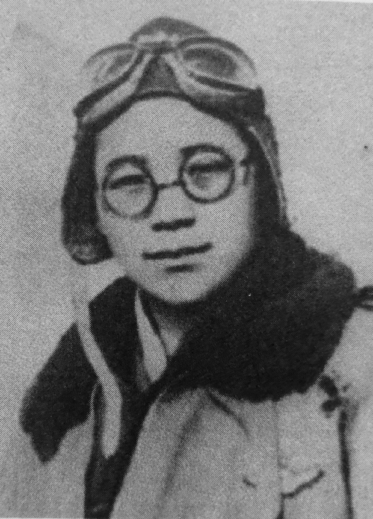
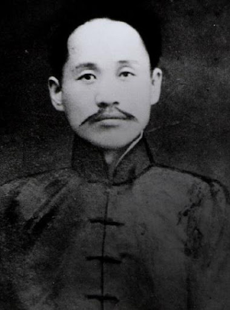
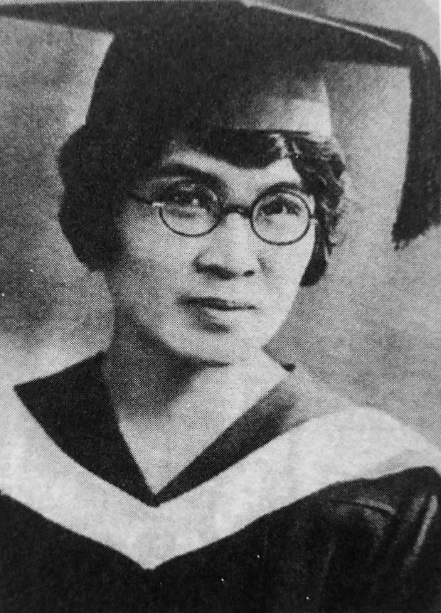

# 이름을 부르다 — 독립운동가 숏츠 제작 파이프라인

독립운동가 한 사람을 60초 안에 소개하되 **이름은 마지막에 부르는** 유튜브 숏츠를
대본 JSON 하나로 끝까지 만들어 내는 파이프라인입니다.

대본을 쓰면 배경 이미지 · 나레이션 · 배경음 · 효과음 · 프레임 · 자막 · 업로드 양식까지
전부 자동으로 나옵니다. 회차마다 손대는 것은 **대본 JSON 하나뿐**입니다.

<p align="center">
  
  
  
</p>

```
훅(선언) → 0.8초 사운드 로고 → 정황 → 힌트 → [0.4초 정적] → 이름 공개 → 여운 → 추모 마무리
```

---

## 무엇이 들어 있나

| | |
|---|---|
| `scripts/` | 파이프라인 24개 — 렌더·TTS·레이아웃·모션·효과음·업로드 양식 |
| `drafts/` | **대본 20편 + 문장 단위 검증 기록** |
| `PRD.md` | 포맷·검증·레이아웃 규칙 전문 (52KB) |
| `channel_setup.md` | 채널 개설·아트·재생목록 설정 |
| `assets/photos/` | 회차별 초상 (퍼블릭 도메인 / 공공누리) |

**대본 JSON이 회차 설정을 전부 갖습니다** — 컷별 문장·이미지·연도·효과, 이름표, 크레딧,
배속, 정적 길이, 출력 경로까지. `build_episode.py`는 회차마다 고치지 않습니다.

### 검증 기록이 핵심입니다

실존 인물을 다루므로 **문장마다 어느 사료의 어느 문장에서 나왔는지**를 대본 안에 적습니다.
근거를 못 대면 지우고, 지운 이유도 남깁니다.

```json
"verified": {
  "3·1운동": "'태극기를 만들어 3·1운동을 준비하였고, 직접 거리에 나가 만세 시위를
             하다 유치장에 구류되기도 하였다' — 백과사전 원문. 05번이 이것이다",
  "쓰지_않은_것": [
    "1932년 상하이사변 정찰비행 — 언론에는 널리 나오나 백과사전 본문에 해당 서술이 없다",
    "'공군의 어머니' — 별칭이라 사실 서술로 쓰지 않는다"
  ]
}
```

이 기록은 `build_archive_page.py`가 읽어 **기록집 HTML**로 렌더합니다.

---

## 필요한 것

| | |
|---|---|
| Python | 3.9+ — 외부 패키지는 **Pillow 하나** |
| ffmpeg / ffprobe | 오디오·영상 처리 전반 |
| Typecast API 키 | 나레이션 TTS (유료) |
| Codex CLI *(선택)* | 배경 이미지 생성. 없으면 직접 넣으면 됩니다 |
| 폰트 3종 | 아래 참고 (라이선스 때문에 저장소에 넣지 않았습니다) |

```bash
pip install pillow
brew install ffmpeg          # macOS
cp .env.example .env         # TYPECAST_API_KEY 채우기
```

### 폰트 내려받기

`assets/fonts/`에 아래 세 파일을 두세요. 셋 다 **SIL Open Font License**입니다.

| 파일 | 출처 |
|---|---|
| `NotoSerifKR-var.ttf` | [Google Fonts — Noto Serif KR](https://fonts.google.com/noto/specimen/Noto+Serif+KR) |
| `NanumMyeongjo-Bold.ttf` | [Google Fonts — Nanum Myeongjo](https://fonts.google.com/specimen/Nanum+Myeongjo) |
| `NanumMyeongjo-ExtraBold.ttf` | 위와 같음 |

---

## 한 편 만들기

위에서 아래로. 각 단계는 앞 단계가 끝나야 의미가 있습니다.

```bash
# 1. 대본을 쓴다 — verified에 문장별 근거까지. 여기서 막히면 제작에 들어가지 않는다
vi drafts/script_dok_21_xxx.json

# 2. 배경 이미지 (SCENES에 프롬프트를 먼저 넣는다)
python3 scripts/gen_images.py xxx

# 3. 나레이션. 세 번째 인자로 고친 문장만 다시 뽑는다
python3 scripts/generate_tts.py drafts/script_dok_21_xxx.json output/audio/dok_21_xxx

# 4. 마무리 컷 — 이름을 캐리어 문장에서 잘라 조립한다
python3 scripts/make_ending.py 홍길동 --slug ep21_xxx --takes 3          # 후보 3개
python3 scripts/make_ending.py 홍길동 --slug ep21_xxx --takes 3 --pick 2 \
        --apply drafts/script_dok_21_xxx.json                            # 확정

# 5. 렌더 → output/최종본/
python3 scripts/build_episode.py drafts/script_dok_21_xxx.json

# 6. 기록집 HTML
python3 scripts/build_archive_page.py
```

> `--pick`은 **`--takes`와 같이** 줘야 합니다. 루프가 `range(1, takes+1)`이라
> `--pick 2`만 주면 아무 일도 없이 종료됩니다.

### 부품 스크립트

| | |
|---|---|
| `archive_layout.py` | 종이 배경, 찢긴 인화지 카드, 노후화, 자막, 이름표 |
| `render_archive_video.py` | 낙하 전환, 느린 줌, 이징 |
| `live_card.py` | 사진 **안에서** 카메라가 팬·줌 |
| `impact_fx.py` | 폭발·총성 합성 + 화면 흔들림 (회차당 1회) |
| `make_bgm.py` · `make_logo.py` | BGM·사운드 로고 합성 |
| `name_from_carrier.py` | 캐리어 문장에서 이름만 잘라내기 |
| `pitch_fall.py` | 어절 끝 상승 억양을 하강조로 |
| `upload_info.py` | 제목·설명란·태그 생성 (대본 JSON이 단일 출처) |

---

## 설계에서 배운 것 몇 가지

전부 `PRD.md`에 근거와 함께 적혀 있습니다. 실패해 보고 고친 것들입니다.

**훅은 선언으로 연다.** `X는 Y가 아니다`는 답을 미루는 구조라 첫 문장이 질문이 됩니다.
이야기는 `~한 사람이 있었다`로 열어야 이야기로 들립니다.

**연표가 아니라 이야기로 쓴다.** "N년에 A했다 / 몇 살에 B했다"가 이어지면 이력서가 됩니다.
시간을 한 방향으로 펴고, 숫자를 줄이고, 남긴 숫자에는 일을 시킵니다.

**마무리를 한 공식으로 굳히지 않는다.** 20편을 쓰고 마지막 문장만 세로로 훑어보니
아홉 편 중 여덟 편이 같은 어미였습니다. **한 편씩 쓸 때는 안 보입니다.**

**브랜드 나레이션이 이탈을 만들고 있었다.** 유지율에서 7~8초에 30%가 빠졌는데,
그 시점에 채널명을 읽고 있었습니다. 훅은 성공했는데 **직후 3.9초짜리 정보 공백**이
오는 구조였습니다. → 0.8초 사운드 로고로 교체.

**감정은 지어내지 않고 배치로 만든다.** 심리·정황 묘사는 창작입니다.
대신 사료에 있는 사실 둘을 나란히 놓습니다 — "평양에서 태어나 서울에 묻혔다".

**나이는 반드시 생년월일부터 다시 계산한다.** 사료의 나이는 세는나이인 경우가 많고,
실제로 네 회차에서 같은 실수가 반복됐습니다.

**"미확보"는 찾아본 뒤에만 쓸 수 있는 말이다.** 초상이 없다고 적어 둔 여덟 편을
커먼즈 API로 실제 조회하니 여섯 편에 쓸 수 있는 판본이 있었습니다.

---

## 저장소에 없는 것

| | 이유 |
|---|---|
| `output/` | 완성 영상·프레임·음성 1.5GB |
| `assets/fonts/` | 라이선스상 직접 받는 편이 낫습니다 (위 참고) |
| `assets/playlists/` | 재생목록 커버 16MB — `make_playlist_covers.py`로 생성됩니다 |
| API 키 | `.env.example`을 복사해 채우세요 |

---

## 라이선스

| 대상 | 조건 |
|---|---|
| `scripts/` 코드 | **MIT** — 자유롭게 쓰고 고치세요 |
| `PRD.md`, `drafts/` 대본·검증 기록 | **CC BY 4.0** — 출처를 밝히면 자유 이용 |
| `assets/photos/` 초상 | **각 파일마다 조건이 다릅니다** ↓ |

초상은 전부 대본 JSON의 `verified.초상` 항목에 출처와 라이선스를 적어 두었습니다.

- 대부분 **퍼블릭 도메인**(보호기간 만료) — 위키미디어 커먼즈
- `choi_ikhyeon_portrait.jpg`(채용신 「최익현 초상」)는 **공공누리 제1유형**이라
  **출처표시가 이용 조건**입니다: `그림 · 채용신 「최익현 초상」, 국립중앙박물관`

> ⚠️ **초상을 그대로 가져다 쓸 때는 각 회차의 `verified.초상`을 반드시 읽으세요.**
> 커먼즈 라이선스 태그와 원 소장처의 권리 표시가 **충돌하는 경우가 실제로 있었습니다**
> (PD로 달려 있는데 원 소장처는 "무단 복제 금지"였습니다).

이 채널은 **실존 인물**을 다룹니다. 파이프라인을 그대로 쓰시더라도
`PRD.md` 3항(검증 규칙)만은 같이 가져가시길 권합니다.
